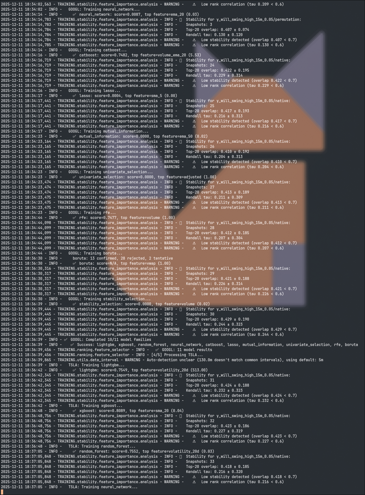

# Feature Selection Tutorial

Select the most important features for your models.

> **Note**: For the intelligent training pipeline, feature selection is automated. See [Intelligent Training Tutorial](INTELLIGENT_TRAINING_TUTORIAL.md) for the automated workflow. This tutorial covers manual feature selection.

## Overview

Feature selection reduces dimensionality and improves model performance by:
1. Training models to get feature importance
2. Ranking features by importance
3. Selecting top N features
4. Retraining with selected features



*Feature selection and stability analysis in action - showing multi-model consensus, feature importance, and stability metrics*

**For automated feature selection**, the intelligent training pipeline uses:
- Multi-model consensus (LightGBM, XGBoost, Random Forest, CatBoost, Neural Network, Lasso, Mutual Information, Univariate Selection, Boruta, Stability Selection)
- **GPU acceleration** (NEW 2025-12-12): LightGBM, XGBoost, and CatBoost automatically use GPU when available for 10-50x speedup
- **Unified threading utilities** (NEW 2025-12-20): All models use centralized threading control from `TRAINING/common/threads.py` for GPU-aware thread management, preventing CPU bottlenecks during GPU training and optimizing OMP/MKL thread allocation
- Consistent preprocessing (shared `make_sklearn_dense_X()` helper for sklearn models)
- Unified interval handling (respects `data.bar_interval` from experiment config)
- **Systematic parameter validation**: All model constructors use `clean_config_for_estimator()` to prevent parameter passing errors (duplicate arguments, unknown parameters). Special handling for:
  - **MLPRegressor**: Sanitizes `verbose=-1` to `verbose=0` (sklearn requires `>= 0`)
  - **CatBoost**: Removes iteration synonyms (`n_estimators`, `num_boost_round`, `num_trees`) when `iterations` is present, converts `random_state` to `random_seed`
  - **Univariate selection**: Handles signed F-statistics by using absolute values for ranking, preserving signal instead of falling back to uniform
  See [Config Cleaner API](../../02_reference/configuration/CONFIG_CLEANER_API.md) for details.
- **Per-model reproducibility tracking**: Tracks reproducibility metrics (delta_score, Jaccard@K, importance_corr) for each model family. Stores in `model_metadata.json` for audit trails. Compact logging: stable = INFO, unstable = WARNING. Symbol-level summaries show reproducibility status across all families. See [Reproducibility Tracking Guide](../../03_technical/implementation/REPRODUCIBILITY_TRACKING.md) for details.
- **Boruta statistical gatekeeper**: Boruta acts as a gatekeeper (not just another scorer), using ExtraTrees to test feature significance and modifying consensus scores via bonuses/penalties
- **Cross-sectional ranking** (optional): Panel model trained across all symbols simultaneously to identify universe-core features vs symbol-specific features. Automatically tags features as CORE/SYMBOL_SPECIFIC/CS_SPECIFIC/WEAK. Enabled via `aggregation.cross_sectional_ranking.enabled` in config. Only runs if `len(symbols) >= min_symbols` (default: 5).
- **Cross-sectional stability tracking**: Tracks factor robustness across runs using top-K overlap, Kendall tau, and snapshot analysis. Provides STABLE/DRIFTING/DIVERGED classification for global factors. Stricter thresholds than per-symbol (overlap ≥0.75, tau ≥0.65) since cross-sectional features should be more persistent. Stores snapshots in `artifacts/feature_importance/{target}/cross_sectional_panel/` and metadata in `cross_sectional_stability_metadata.json`. See [Feature Importance Stability](../../03_technical/implementation/FEATURE_IMPORTANCE_STABILITY.md) for details.
- **Reproducibility logging**: Per-symbol debug logs showing base_seed, n_features, n_samples, and detected_interval for reproducible behavior verification
- See [Ranking and Selection Consistency](RANKING_SELECTION_CONSISTENCY.md) for details

## Quick Start

### Single-Target Selection

```python
from TRAINING.training_strategies.strategies.single_task import SingleTaskStrategy
# Backward compatibility: from TRAINING.strategies.single_task import ... still works

# Train on all features
config = load_model_config("lightgbm", variant="conservative")
strategy = SingleTaskStrategy(config)
strategy.train(X, {'fwd_ret_5m': y}, feature_names)

# Get feature importance from trained model
importances = strategy.get_feature_importance()

# Select top 50 features
top_50 = sorted(importances.items(), key=lambda x: x[1], reverse=True)[:50]
selected_features = [f[0] for f in top_50]

# Retrain with selected features
X_selected = X[selected_features]
strategy.train(X_selected, {'fwd_ret_5m': y}, selected_features)
```

> **Note**: `scripts.feature_selection` module does not exist. Use the strategy's `get_feature_importance()` method instead.

### Multi-Target Selection

```python
from TRAINING.training_strategies.strategies.multi_task import MultiTaskStrategy
# Backward compatibility: from TRAINING.strategies.multi_task import ... still works

# Train on all features with multiple targets
targets = {
    'fwd_ret_5m': y_5m,
    'fwd_ret_15m': y_15m,
    'fwd_ret_30m': y_30m
}
strategy = MultiTaskStrategy(config)
strategy.train(X, targets, feature_names)

# Get aggregated importance
importances = strategy.get_feature_importance()
top_50 = sorted(importances.items(), key=lambda x: x[1], reverse=True)[:50]
selected_features = [f[0] for f in top_50]
```

## Feature Selection Methods

### Importance-Based

Uses model feature importance (LightGBM/XGBoost):

```python
from TRAINING.training_strategies.strategies.single_task import SingleTaskStrategy
# Backward compatibility: from TRAINING.strategies.single_task import ... still works
from CONFIG.config_loader import load_model_config

config = load_model_config("lightgbm", variant="conservative")
strategy = SingleTaskStrategy(config)
strategy.train(X, {'target': y}, feature_names)

# Get importance and select top features
importances = strategy.get_feature_importance()
top_50 = sorted(importances.items(), key=lambda x: x[1], reverse=True)[:50]
selected = [f[0] for f in top_50]
```

### Recursive Feature Elimination

> **Note**: RFE functionality is not available in `scripts.feature_selection`. Use sklearn's RFE with your trainer:

```python
from sklearn.feature_selection import RFE
from TRAINING.model_fun import LightGBMTrainer

trainer = LightGBMTrainer(config)
selector = RFE(trainer, n_features_to_select=50)
X_selected = selector.fit_transform(X, y)
selected = [feature_names[i] for i in range(len(feature_names)) if selector.support_[i]]
```

## Comprehensive Ranking

Rank features by both predictive power and data quality:

```python
python SCRIPTS/rank_features_comprehensive.py \
    --data data/labeled/AAPL_labeled.parquet \
    --target target_fwd_ret_5m \
    --output results/feature_ranking.csv
```

## Best Practices

1. **Start with all features**: Train on full feature set first
2. **Use multiple methods**: Combine importance and RFE
3. **Validate selection**: Check performance with selected features
4. **Monitor stability**: Feature importance should be consistent

## Reducing from 421 to 50 Features

```python
# Step 1: Train on all 421 features
strategy = SingleTaskStrategy(config)
strategy.train(X_all, y, feature_names_all)

# Step 2: Get importance
importances = strategy.get_feature_importance()

# Step 3: Select top 50
top_50 = sorted(importances.items(), key=lambda x: x[1], reverse=True)[:50]
selected_features = [f[0] for f in top_50]

# Step 4: Retrain
X_selected = X_all[selected_features]
strategy.train(X_selected, y, selected_features)
```

## Next Steps

- [Intelligent Training Tutorial](INTELLIGENT_TRAINING_TUTORIAL.md) - Automated feature selection workflow (recommended)
- [Ranking and Selection Consistency](RANKING_SELECTION_CONSISTENCY.md) - Unified pipeline behavior (includes sklearn preprocessing details)
- [Feature Selection Implementation](../../03_technical/implementation/FEATURE_SELECTION_GUIDE.md) - Implementation details
- [Modular Config System](../../02_reference/configuration/MODULAR_CONFIG_SYSTEM.md) - Config system guide
- [Usage Examples](../../02_reference/configuration/USAGE_EXAMPLES.md) - Practical configuration examples

